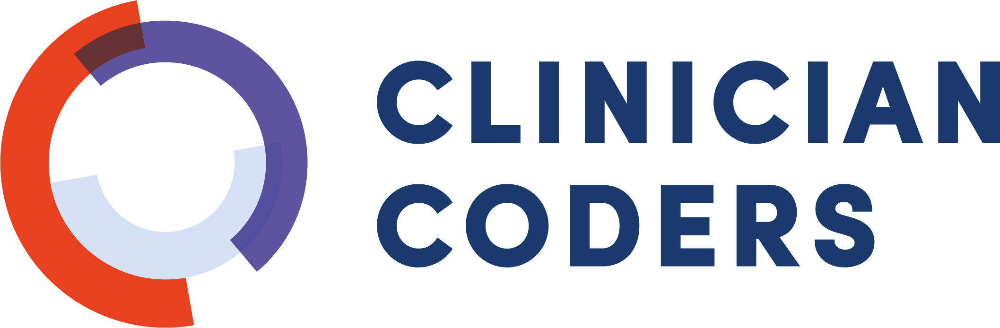

##

## Hello!

- Pre-requisites
- Course schedule
- Online format
- What to expect from the workshops
    - Data
    - Layout

::: notes
Say that this is a quick intro to the course. And that this is what we cover during this intro.
:::

## Pre-requisites

- Does everyone have R studio installed?
- Does everyone have a spreadsheet program?
- Has everyone decided on a dataset? 

::: notes
Go through each item on list, make sure each person has completed all items. You can spend some time on this slide.
:::

## Schedule - Day 1 & 2

**Day 1**

- 13:00 - 13:30: Start and Welcome
- 13:30 - 15:00: Workshop 1: Introduction to R
- 15:00 - 15:15: Coffee Break
- 15:15 - 16:00: Workshop 2: Cleaning your Dataset

**Day 2**

- 13:00 - 14:15: Workshop 3: Getting your Data into R 
- 14:15 - 14:30: Coffee Break
- 14:30 - 16:45: Workshop 4: Data Wrangling 

## Schedule - Day 3 & 4

**Day 3**

- 13:00 - 14:30: Workshop 5: Data visualization
- 14:30 - 14:45: Coffee break
- 14:45 - 16:00: Workshop 6: Control flow and looping (part 1)

**Day 4**

- 13:00 - 13:45: Workshop 6: Control flow and looping (part 2)
- 13:45 - 14:00: Coffee break
- 14:00 - 16:00: Workshop 7: Using your own data

## Online format

- Please keep your camera turned on for the duration of the course to foster a "classroom" feeling.
- We ask that you are willing to share your screen for troubleshooting.
- Questions:
  - **General questions related to current workshop** --> raise a virtual hand
  - **Participant-specific questions/issues that are hindering ability to follow workshop** --> navigate to a break-out room 
  - **Participant-specific questions/issues that do not require immediate assistance** --> post these in the Teams chat

## The data

- We use the Critical Care Health Informatics Collaborative dataset.

- Multicentre adult intensive therapy unit database
    - 11 adult intensive care units
    - 5 UK teaching hospitals
    - Privacy ensured through “highest standards of data security”
    - 18, 074 unique patients
    
- You will be using a synthetically derived dataset structured in a similar format to the CCHIC data. 
- Data looks real, but isn't.

## Workshop layout

- 7 workshops
    - These include presentations and chances for you to follow along on your laptops.
    - Workshop 2: You work your way through a worksheet during . 
    - Workshop 7: You try to answer a question of your own using data. We will ask you to submit this question by the end of Day 3.
- A pdf file is available on the GitHub: https://github.com/ClinicianCoders/ClinicianCoders/blob/master/Handout.pdf. It contains all of the content from the course workshops for future reference.  

## Final note - tips on writing code

- Save your work frequently!
- It takes a while to get the hang of writing code. 
- Be mindful as you type code out. 
    - Check your punctuation (e.g. placement of `()` or `,`). 
    - Capitalisation matters (e.g. `Data` vs `data`).
- Google is your friend.
- Tell us if you spot any errors we've made!

# **Thank you. We hope you enjoy the course.**
