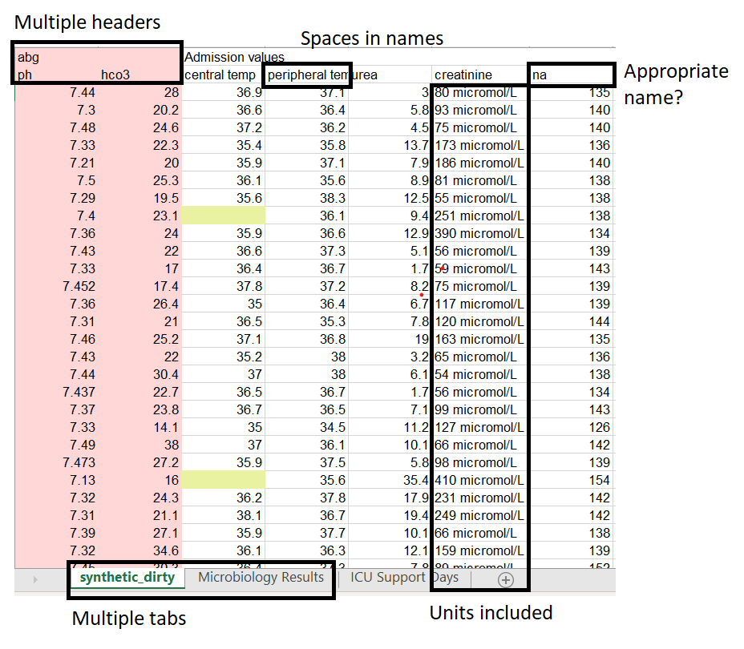
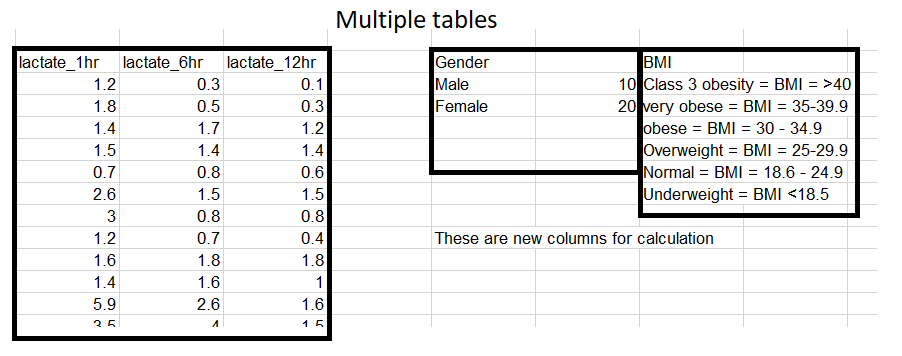

##

## What is "tidy" data?

::: notes
Each variable has it's own column. Each observation has its own row. And finally, each value has it's own cell.
:::

## What is "messy" data?

## What is "messy" data?

## Exercise

1. Identify messy aspects of the data.
    - Hint: "Common Mistakes to Avoid and Correct" in the handout can provide some inspiration.
2. How would you tidy this? Break down your strategy into individual steps.
3. If you finish early, use the `dplyr` and `stringr` cheat sheets to start identifying appropriate `R` functions.
    - `dplyr`: https://rstudio.com/wp-content/uploads/2015/02/data-wrangling-cheatsheet.pdf
    - `stringr`: http://edrub.in/CheatSheets/cheatSheetStringr.pdf 
