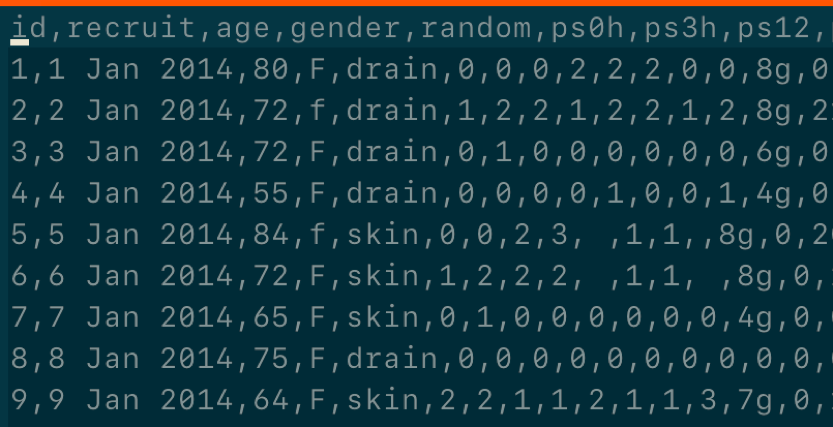
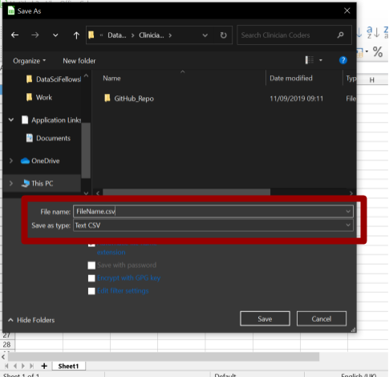
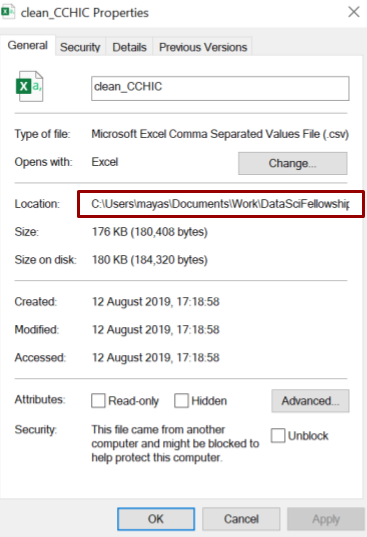
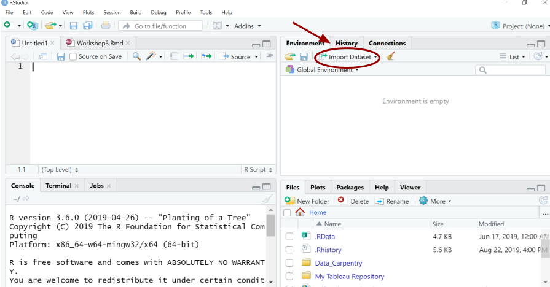
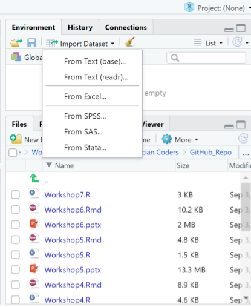
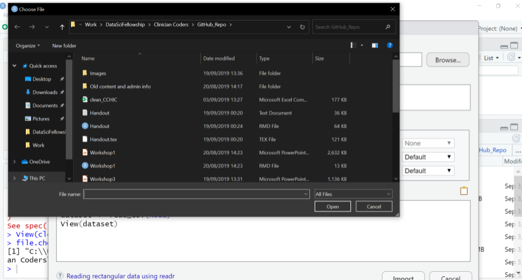
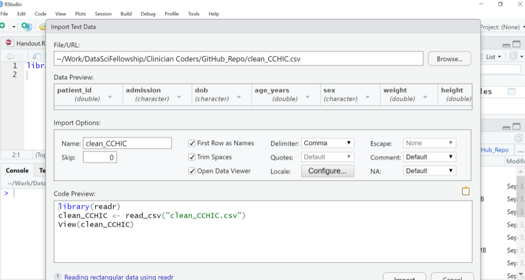

```{r, include=FALSE}
library(readr)
library(googlesheets)
cchic <- read_csv("../clean_CCHIC.csv")
```

##


## What will this workshop teach you?

1.  Getting `.csv` files into R.  
2.  Initial exploration of your data set.  
\newparagraph

- The handout also includes some tips on importing data from Google Sheets.

## Introduction
- You have now learnt to input data into R manually.  
- But what happens if you are given an Excel spreadsheet and told to analyse it?  
  - How can you look at and work with that data in R?
  
## What is a CSV file?
::::::::::::{.columns}
:::{.column}
- *Comma separated values* file:  
    - You still have columns and rows.       
    - However, data values on a single row are separated by commas instead of walls of a cell.  
    - Excel spreadsheets are easily converted into this format.
:::
:::{.column}

:::
:::::::::::: 


## Time Out
::::::::::::{.columns}
:::{.column}
- Take a moment to download the practice data set.
- Available in `.csv` format:   

  - `clean_CCHIC` 
  
  - Open and `Save As` a `.csv` file

:::
:::{.column}

:::
:::::::::::: 

::: notes
Upload file to MS Teams/Slack.
:::

## Files, directories and file paths
- R can not read your data if it does not know where it is stored.
- Your computer has a system for storing files within directories.
- Directories are also known as folders.
- The language used to instruct on the location of the file in known as the `file path`. 

## File paths
::::::::::::{.columns}
:::{.column}
- Starts with a `Root directory` and then `Branches` are specified.
- You can find out the file path name by right clicking on any file:
  - `Properties` in Windows
  - `Get Info` in Mac  
- Folders within directories are specified with:
  - `/` in Mac  
  - `\\` in Windows
- However, the correct notation in R for both is `/`
:::
:::{.column}

:::
::::::::::::

## Finding and setting your Working Directory
::::::::::::{.columns}
:::{.column}
- R will have chosen a working directory for you.  

```{r, eval = F}
getwd()
```

- Will display your working directory in your console.  
- You can then reset it to your desired working directory using. 

```{r, eval = F}
setwd()
```
:::
:::{.column}

:::
::::::::::::

::: notes
Candidates don't necessarily need to do this at the moment.
:::

## Brief interlude...

- Common file path problems:

    - You want to run the same script on a different platform (e.g. Windows --> UNIX), but the path to the data is now different.
    - You want to be able to easily switch between projects, which live in different directories, without having to change your working directory every time.

## Brief interlude... 

- The answer to this: "Project-oriented workflows"

    - [What They Forgot to Teach You About R](https://rstats.wtf/index.html) -- see Chapter 2 on Project-oriented workflows.
    - The package [here](https://here.r-lib.org/articles/here.html) is an excellent package for making the most of project-oriented workflows.
    - And for the You-Tubers among you, check out: [Improve your workflow for reproducible science](https://www.youtube.com/watch?v=JA-vLsN-sic&feature=youtu.be)

## Getting your work into R  

1.  Point and click  

      - Less fiddly as no need to write code   
      
      - But not reproducible  

2.  Using commands  

      - Better for reproducibility
      
      - Someone else would just have to replace the source code to run the code on their own computer  
      
3.  Connecting to an online database or google spreadsheet 
      - This will only be mentioned in the handout
      
::: notes
Three main methods
:::

## Method 1: Point and click
::::::::::::{.columns}
:::{.column}
Click `Import Dataset` tab in the `Environment` pane  

:::
:::{.column}

:::
::::::::::::

##  
::::::::::::{.columns}
:::{.column}
- Choose `From text (readr)`
:::
:::{.column}

:::
::::::::::::

## Browse files
::::::::::::{.columns}
:::{.column}
- Now browse for your file  
- Click on the file you wish to select  
- Then select `Import`  
- IF you try this you will notice there is no text in the source pane. This method is not reproducible.  
:::
:::{.column}

:::
::::::::::::

## How can I make this reproducible? 
::::::::::::{.columns}
:::{.column}
- Look for the code in the `Code Preview`
- You can copy and paste this code into your source pane to make this step reproducible 
:::
:::{.column}

:::
::::::::::::

## Method 2: Commands
- `readr` is a package containing functions to help R *read* your external files  
- It is automatically installed with `tidyverse`  
- Install and load the package as follows  

```{r, eval = F}
install.packages("tidyverse")
library(tidyverse)
```

## Read your file

- You can then tell R to read a CSV file by writing the full file path name. This is an example file path, but what you need to type depends on where you stored the data on your computer. 

```{r, eval = F}
# You are saving your data in an object called "cchic"
cchic <- read_csv("C:/Users/rhrey/OneDrive - University College London/ClinicianCoders_wd/ClinicianCoders/clean_CCHIC.csv")
```

- Display the contents of the data frame `cchic`.

```{r, eval = F}
cchic
```

::: notes
Get them to do this
:::

## Tibble


## Viewing your data in R
::::::::::::{.columns}
:::{.column}
- You have imported your data into R.
- You need a neat way of looking at it. 

```{r, eval = F}
View(cchic)
```

- The data is displayed in a familiar spreadsheet format. 
  - This is a more human-legible table.  
  - You can also view the data via the environment pane.
:::
:::{.column}
.png)
:::
::::::::::::

## Shortcuts

- There are notations to shorten the code for the file path.  
- Use single dot for a file within current working directory.
- Use double dot `..` for a file in the directory above the current working directory.
```{r, eval = F}
read_csv("../clean_CCHIC.csv")
```

## Reviewing your data in R

- Spreadsheets in R are called data frames 
- You can use these functions to investigate your data frame: 

    - `head(cchic)`  
    - `tail(cchic)`  
    - `names(cchic)`  
    - `class(cchic)`  
    - `str(cchic)`  
      
## head()

```{r, eval = F}
head(cchic)
```

- Prints the first 6 rows of the data frame.

## tail()

```{r, eval = F}
tail(cchic)
```

- Prints the last 6 rows of the data frame.

## names()

```{r, eval = F}
names(cchic)
```

- Prints the names of the variables. 

## class()

```{r, eval = F}
class(cchic)
```
- Prints the class of the object `cchic`.

## str()

```{r, eval = F}
str(cchic)
```

- Prints the data type of each variable in `cchic`.

## Look at specific items

- You can look at specific data points.

```{r}
cchic[21, 5]
```

- This displays the the piece of data in the 21st row and 5th column.

## Selecting variables using $ sign

- You can also use the `$` function.
- Enter `data_frame_name$variable_name`

```{r, eval = F}
cchic$weight
```

- This will list all of the data in the weight column.

## Other tools to review data

- Specific functions from special packages help you describe the whole data set.
- The function will look at each variable and will give you basic measures about the data, for example range and mean.
- The data will also be described in a number of plots.
  - `Desc()` from `DescTools` package
  - `describe()` from `Hmisc` package  
- To use these you have to install the appropriate packages.

```{r, echo = F, eval = F}
DescTools::Desc(cchic)
Hmisc::describe(cchic)
```

::: notes
Let them explore these if you have time.
:::

## Exercise
1. What types of variables do you have in `cchic`?
2. Display the `discharge_dttm` vector from in `cchic`.
3. How many men and women are in the database?
4. How many survived and how many died?
5. a) What does the function `ls()` do? 
   b) Use it to see how many vectors contain information about "temp".
  
## Answer 1.
- What types of variables do you have in `cchic`?

```{r, eval = F}
str(cchic)
```

## Answer 2
- Display the `discharge_dttm` vector in `cchic`.
```{r, eval = F}
cchic$discharge_dttm
```

## Answer 3
- How many men and women are in the database?
```{r}
table(cchic$sex)
```

## Answer 4
- How many survived and how many died?
```{r}
table(cchic$vital_status)
```

## Answer 5
- What does the function `ls()` do?
```{r}
ls(cchic, pattern = "temp")
```

- This lists all of the variables in `cchic` containing the word "temp".
