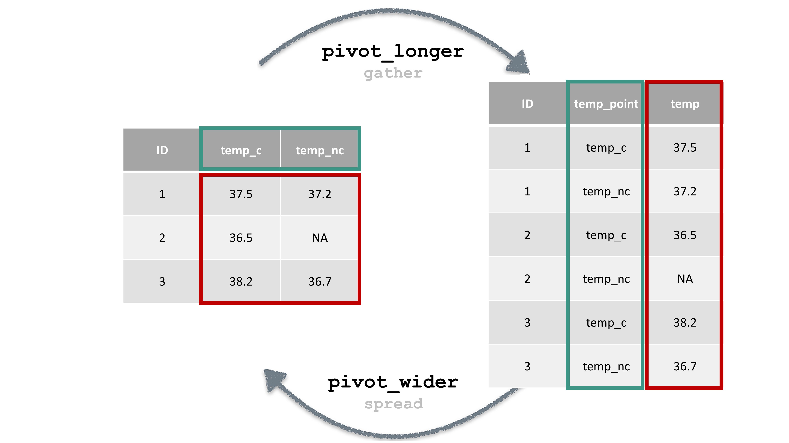

```{r, include = FALSE}
# We will need this data later. 
library(tidyverse)
library(lubridate)
cchic <- read_csv("../clean_CCHIC.csv")
cchic <- cchic %>%
  mutate(los = difftime(ymd_hms(discharge_dttm),
                        ymd_hms(arrival_dttm), units = "days"))
```

##


## Content

- Using the `dplyr` package.
- Standard methods for selecting data.
- Recipes to perform common operations, such as:
    - Manipulating strings
    - Manipulating dates
    - Changing data structure

## What is data wrangling?

- The process of transforming raw data into a form you can use for analysis.
- Steps include:
    - Cleaning the data (Workshop 2) - as tempting as it might be to do this in Excel, for reproducibility, always try to do this in R.
    - Organising it into a structure that allows you to analyse it.
    - Creating derived variables from raw data.
    - Validating the data.

## Another way to think of it... 

:::::::::::::: {.columns}
::: {.column}
- Taking raw data
- Subjecting it to processes along a data pipeline
- Using the processed data for analysis
:::
::: {.column}

:::
::::::::::::::

## Load dplyr


- `dplyr` is a package containing functions to help manipulate data.   
- It is automatically installed with `tidyverse`.
- As we have already installed `tidyverse`, we simply need to load the package.

```{r, eval=FALSE}
# You need to load the package each time you open R.
library(tidyverse)
```

## Load data


From the previous workshop, you should still have a data frame named `cchic` in your environment.
If not, please load it again.

## Two concepts you need to know before using dplyr

- The pipe
- Logical operators

## The pipe 

:::::::::::::: {.columns}
::: {.column}
- Takes whatever you did before, and passes it on to the next function.
- Whenever you see it, think of the word 'then'. 
```{r, eval = F}
data_frame_name %>% 
  dplyr::select(column_name) %>% 
  mean()
```
- Shortcut - `Cmd + Shift + M` (Mac) `Ctrl + Shift + M` (Windows)
:::
::: {.column}

:::
::::::::::::::
::: notes
Tell them that there are a couple of things we need to cover about dplyr before we start working with it. This is the first one.
:::

## Logical operators

- You use them to compare values
    - `==`   (equal to)
    - `!=`   (not equal to)
    - `>`   (greater than)
    - `<`   (less than)
    - `>=`   (greater than or equal to)
    - `<=`   (less than or equal to)
    - `is.na()`   (is the value missing)

- More than one condition?
    - `&`   (and)
    - `|`   (or)

::: notes
This is the second thing we need to learn. It applies to most parts of R.
:::

## Example of using logical operators

Try running:
```{r}
test_age <- c(50, 25, 32, 67, 46, 19)

# What elements in the vector are >= 65?
test_age >= 65

```

It should return a logical vector. This can then be used to filter your vector.

```{r}
# Extract elements of vector which are >= 65
test_age[test_age >= 65]
```

## filter()

Choose rows based on the conditions you specify.

```{r, eval = FALSE}
cchic %>%
  dplyr::filter(age_years >= 65)
```

The output is a data frame where all patients are 65 years or older.

::: notes
Dplyr works using 'verbs'. The first one is `filter`.
:::

## select()

Allows you to choose specific variables from your dataset.

```{r, eval = FALSE}
cchic %>%
  dplyr::select(sex)
```

Output is a data frame with the gender of all patients.

::: notes
The second verb is select.
:::

## Using filter() and select() together

```{r, eval = FALSE}
cchic %>%
  dplyr::filter(age_years >= 65) %>%
  dplyr::select(sex)
```

Output is the gender of patients who are 65 years or older.

**Question**:What happens if you do `select()` and then `filter()`? 

## Using filter() and select() together

**Question**:What happens if you do `select()` and then `filter()`? 

*You have removed the age variable from the dataset, so you can’t filter based on age.*

## Piped data with functions

Piped data can be passed on to almost any function in R

```{r, eval = FALSE}
cchic %>%
  dplyr::filter(age_years >= 65) %>%
  dplyr::select(sex) %>%
  summary()
```

Gives information on gender for patients older than 65.

## Other dplyr wrangling verbs

- `group_by()`
- `summarise()`


## Exercise: Using group_by() and summarise()

**Try this.**
```{r, eval = FALSE}
cchic %>%
  dplyr::group_by(sex) %>%
  dplyr::summarise(mean_urea = mean(urea))
```

- What is the output?
- Hint – check for missing values in `cchic$urea`. You made need to add an additional argument in the function `mean`, which removes missing values. 

## Solution: Using group_by() and summarise()

```{r}
cchic %>%
  dplyr::group_by(sex) %>%
  dplyr::summarise(mean_urea = mean(urea,
                                    na.rm = TRUE))
```

An alternative is to filter out the missing values of urea.

## Take a break. Any questions?

Make sure you are happy running

- `filter()`
- `select()`
- `group_by()`
- `summarise()`

## Favourite data tidying 'recipes'

1. Rename a variable
2. Create a new variable
3. Extract numbers
4. Extract strings
5. Parse dates
6. Convert columns to rows and back again 
7. Delete columns

## 1. Rename a variable


```{r, eval = FALSE}
names(cchic)
```

The variable called `na` is very confusing

```{r, eval = FALSE}
cchic <- cchic %>%
  dplyr::rename(sodium = na)
```


## 2. Create a new variable

Use the `mutate()` function 

```{r, eval = FALSE}
cchic <- cchic %>%
  dplyr::mutate(bmi = (weight / (height^2)))
```


## 3. Extract numbers

Parse numbers from text using the `readr` package.

```{r, eval = FALSE}
library(readr)
```

Create a vector where the unit has been included as part of the value.
You can't do maths on this vector. 
```{r, eval = T}
weight <- c("70kg", "80 kg", "82 kg", "74", "39")

weight <- readr::parse_number(weight)
str(weight)
```

## 4. Manipulate strings

```{r}
library(stringr)
test_gender <- c("f", "F", "M", "f")
```

Notice that `female` is coded in 2 different ways  

We can change all of the letters to uppercase.
```{r}
test_gender <- stringr::str_to_upper(test_gender)
test_gender
```

Look at the manipulate strings cheat sheet (https://resources.rstudio.com/rstudio-developed/strings) for other functions you can use.


## 5. Working with dates

R treats dates as characters unless you tell it not to.

```{r, message = FALSE}
library(lubridate)

test_dates <- c("02-01-12", "03-04-15", "15-06-02")
```

Convert these characters to dates. 
```{r}
test_dates <- lubridate::dmy(test_dates)
test_dates
```


## 5. Working with dates - parsing dates

We can extract components of dates. 

Extracting years

```{r, eval = FALSE}
cchic <- cchic %>% 
  dplyr::mutate(year_born = year(ymd(dob)))

str(cchic$year_born)
```

Extracting days

```{r, eval = FALSE}
cchic <- cchic %>% 
  dplyr::mutate(discharge_day = day(ymd_hms(discharge_dttm)))

str(cchic$discharge_day)
```

## 5. Working with dates - date intervals

We often want to calculate the difference between two dates or times.
Let's calculate the length of stay of patients admitted to the ICU.

```{r, eval = FALSE}
cchic <- cchic %>%
  dplyr::mutate(los = difftime(ymd_hms(discharge_dttm),
                        ymd_hms(arrival_dttm), units = "days"))
```


## 6. Columns to rows and back again



::: notes
Warn them that this concept takes a while to grasp. Also, warn participants that gather/spread have been superseded by pivot_longer/pivot_wider.
:::

## Why do this?

- You may want to calculate the mean and standard deviation of all temperatures, and don’t care about the source.
- You may want to plot all temperatures on a graph.
- Instead of temperature area, you may have temperature on day 1, 2 etc. 

## Converting the data

**Try this.**
```{r, eval = TRUE}
cchic_long <- cchic %>%
  tidyr::pivot_longer(
    cols = temp_c:temp_nc, 
    names_to = "temp_point",
    values_to = "temperature"
  ) %>% 
  dplyr::select(nhs_number, contains("temp"))

names(cchic_long)
```

## Plotting the "longer" data

```{r, eval = T}
cchic_long %>%
  ggplot(aes(
    x = temp_point, y =
      as.numeric(temperature)
  )) +
  geom_boxplot()
```

## What if we want to convert it back?

We can use the `tidyr` function, `pivot_wider()`.

```{r, eval = T}

cchic_reverted <- 
  cchic_long %>%
  tidyr::pivot_wider(
    names_from = temp_point,
    values_from = temperature
  )

names(cchic_reverted)
```

Notice that the variables "temp_c" and "temp_nc" are seperate again.

## 7. Deleting columns

What if we wanted to remove the `temp_nc` variable?

```{r, eval = FALSE}
cchic %>%
  dplyr::select(-temp_nc)
```

The `-` sign means deselect here. 

Don’t forget to assign the above code to something, otherwise the output won’t be saved.

## Excercise

1. How many patients weigh more than 70kg?
    - Hint - look at the `n()` function. 

2. Outcome of patients who were 60 years or older?
    - What is the mean length of stay of patients who are 60 years or older?
    - How many of these patients were discharged alive?
    - Hint - the variable `vital_status` indicates if the patient was alive or dead on discharge.

## How many patients weigh more than 70kg?

```{r}
cchic %>%
  dplyr::filter(weight > 70) %>%
  dplyr::summarise(number = n())
```

## Outcome of patients who were 60 years or older.

```{r, eval = FALSE}
# Mean length of stay
cchic %>%
  dplyr::filter(age_years >= 60) %>%
  dplyr::summarise(los = mean(los, na.rm = TRUE))
```

```{r}
# Number of people alive at discharge.
cchic %>%
  dplyr::filter(age_years >= 60) %>%
  dplyr::select(vital_status) %>%
  table()
```

