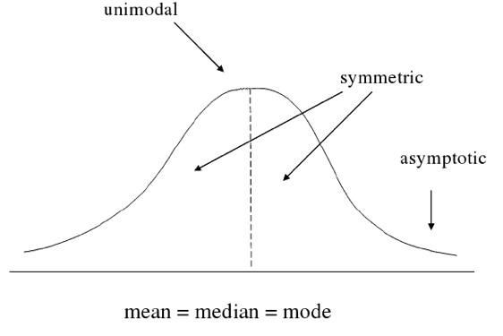
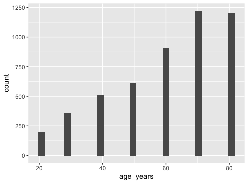
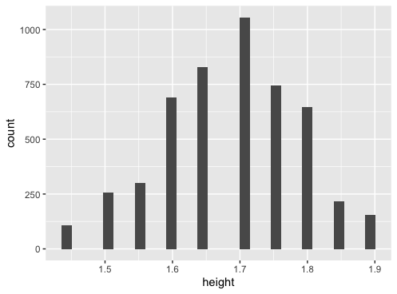
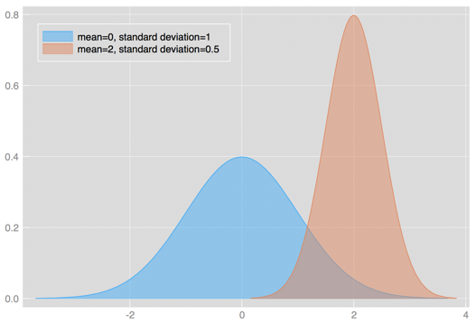
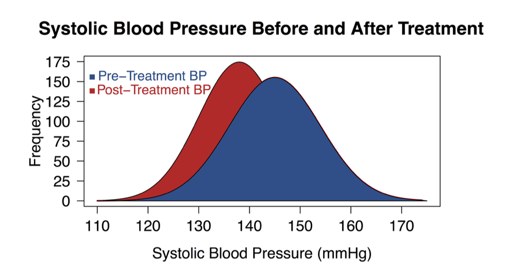

```{r, include = FALSE}
# We will need this data later.
library(tidyverse)
library(lubridate)
cchic <- read_csv("../intermediate_CCHIC.csv")
```

##


## Preface

This workshop has been deprecated as of the the Clinician Coders Workshop in **November 2020**. The workshop on control flow and looping (previously workshop 7) has replaced it. However, the material is kept here to allow previous course attendees (and future) to refer back to this if they are interested. 

## Content

- Types of Data
- Exploring your dataset
- Descriptive statistics
- Conducting statistical tests in R

## 

## Wait!

- Make sure `cchic` R dataframe from your work yesterday is loaded
- Ensure this includes the variables you created including `los`
- The `los` columns comes pre-generated in the `intermediate_CCHIC.csv` file. 

::: notes
Help them load the dataset if needed. This is the same one they used in the morning. It should include the length of stay variable.
:::

## The big picture

- Research often seeks to answer a question about a larger population by collecting data on a small portion 
- Hypothesis driven

## Data types

- Continuous 
- Discrete
    - Nominal
    - Ordinal 
    - Interval

::: notes
Data types have been covered in course before. The next few slides should be a bit of a recap.
:::

## Continuous variables

:::::::::::::: {.columns}
::: {.column}
- e.g. age, height, weight 
- Have distributions:
    - Gaussian
    - Poisson
    - Binomial
:::
::: {.column}

:::
::::::::::::::

## What is normally distributed data?



## Types of discrete variables

- Nominal 
    - e.g. hair colour, types of antibiotics 
    - There is no order between the data types (e.g. blonde, brunette, red hair)

## Types of discrete variables

:::::::::::::: {.columns}
::: {.column}
- Ordinal 
    - There is an order e.g. `care_level` where Level 3 > Level 2 > Level 1 etc.
    - However, the difference between Level 1 and Level 2 critical care may not be the same as the difference between Level 2 and Level 3. 
:::
::: {.column}

:::
::::::::::::::

## Types of discrete data

:::::::::::::: {.columns}
::: {.column}
- Interval
    - There is an order to data points (e.g. `age_cat` for age centile) and the difference
    between these points are equal (e.g. 10 years)
    - You can bin a continous variable into intervals. 
:::
::: {.column}

:::
::::::::::::::

## Describing data

- Continuous variables
- Discrete variables

::: notes
How do we convey information on what your data looks like, using numbers or figures?
:::

## Describing continuous data.

:::::::::::::: {.columns}
::: {.column}
First establish the distribution of the data. 

```{r, eval = F}
ggplot(cchic, aes(x = age_years)) +
  geom_histogram()
```

What is the distribution of this data?
:::
::: {.column}

:::
::::::::::::::

## What is the distribution of height?

:::::::::::::: {.columns}
::: {.column}

Try this command

```{r, eval = FALSE}
ggplot(data = cchic, aes(x = height)) +
  geom_histogram()
```
What is the distribution of this data?
:::
::: {.column}

:::
::::::::::::::

## Parametric vs non-parametric data

- Parametric data
    - The data follows a known distribution
    - It can be described using *parameters*
    - Examples of distributions include normal, poission, exponential.

- Non parametric data
    - The data can't be said to follow a known distribution

::: notes
Emphasise that parametric is not equal to normal.
:::

## Describing parametric and non-parametric data

How do you use numbers to convey what your data looks like.

- Parametric data 
    - Use the parameters that describe the distribution.
    - For a Gaussian (normal) distribution - use mean and standard deviation
    - For a Poission distribution - use average event rate
    - etc.
- Non-parametric data
    - Use the median (the middle number when they are ranked from lowest to highest) and the interquartile range (the number 75% of the way up the list when ranked minus the number 25% of the way)

- You can use the command `summary(data_frame_name)` to get these numbers for each variable.

## Mean versus standard deviation

- What does standard deviation mean?
- Both graphs have the same mean (center), but the second one has data which is more spread out.

```{r, eval = FALSE}

# small standard deviation
dummy_1 <- rnorm(1000, mean = 10, sd = 0.5)
dummy_1 <- as.data.frame(dummy_1)
ggplot(dummy_1, aes(x = dummy_1)) +
  geom_histogram()

# larger standard deviation
dummy_2 <- rnorm(1000, mean = 10, sd = 20)
dummy_2 <- as.data.frame(dummy_2)
ggplot(dummy_2, aes(x = dummy_2)) +
  geom_histogram()
```


::: notes
Get them to plot the graphs. Explain that we are generating ramdom data from different distributions and plotting them. 
::: 

## Calculating mean and standard deviation

```{r, eval = T}
mean(cchic$height, na.rm = TRUE)
```

```{r, eval = T}
sd(cchic$height, na.rm = TRUE)
```

The `na.rm` argument tells R to ignore missing values in the variable. 

## Calculating median and interquartile range

```{r, eval = T}
median(cchic$age_years, na.rm = TRUE)
```
```{r, eval = T}
IQR(cchic$age_years, na.rm = TRUE)
```

Again, we ignore the missing values.

## Describing discrete data

- Frequencies
```{r, eval = T}
table(cchic$vital_status)
```

- Proportions
```{r, eval = T}
status <- table(cchic$vital_status)
prop.table(status)
```

## Meaningful analysis

- What is your hypothesis

- What type of variables (data type) do you have?

- What are the assumptions of the test you are using?

- Interpreting the result

## What is a p-value?


## What we are usually hoping...



## Testing significance

- p-value

- <0.05

- 0.03-0.049
    - Would benefit from further testing. 
    
## Comparing means

It all starts with a hypothesis

- Null hypothesis
    - “There is no difference in mean height between men and women”

- Alternate hypothesis
    - “There is a difference in mean height between men and women”
    
## Comparing means

Is there a difference between the heights of males and females?

```{r}
cchic %>%
  group_by(sex) %>%
  summarise(av.height = mean(height, na.rm = TRUE))
```
    
Is the difference between heights statistically significant?

::: notes
Note that these number may not be the same as the one candidates see on their screens. These slides are based on a smaller version of the dataset. 
:::

## t-test

:::::::::::::: {.columns}
::: {.column}
- Compares means between two populations
- Paired vs. Unpaired
:::
::: {.column}

:::
::::::::::::::

## Assumptions of a t-test

- One independent categorical variable with 2 groups and one dependent continuous variable

- The dependent variable is approximately normally distributed in each group

- The observations are independent of each other

## Doing a t-test

```{r, eval = FALSE}
t.test(height ~ sex, data = cchic)
```

::: notes
Tell them to do this.
:::

## Doing the t-test

```{r, echo = FALSE}
t.test(height ~sex, data = cchic)
```

::: notes
Quickly explain the main points of the output
:::

## Comparing counts

- Is survival different between genders?

```{r}
table(cchic$sex, cchic$vital_status)
```

## What is our hypothesis?

- Null hypothesis
    - There is no difference in survival between men and women 
    
- Alternate hypothesis
    - There is  a difference in survival between men and women 
    
## Assumptions of the chi-squared test.

1.  Data in cells should be frequencies or counts *not* percentages
2.  Levels/Categories are mutually exclusive – here being a alive/dead applies
3.  Each subject contributes to one cell – can either be male/female and alive/dead
4.  Independent study groups
5.  2 categorical variables
6.  Values in each cell should be 5+

`Biochem Med (Zagreb). 2013 Jun; 23(2): 143–149.`

## Doing the chi-squared test.

Start with `?chisq.test`. 
Then do the test.

```{r}
chisq.test(cchic$sex, cchic$vital_status)
```

::: notes
Get them to do this, then explain the output.
:::

## Non-parametric versions

Is length of stay different between genders?

```{r, message=FALSE}
ggplot(data = cchic, aes(x = los)) +
  geom_histogram() +
  facet_grid(~sex)
```

## When do you use a non-parametric test?

- When any of the the following are true.
    - Level of measurement is nominal or ordinal
    - Unequal sample sizes
    - Skewed data
    - Unequal variance
    - Continuous data collapsed into small number of categories

## Using the Mann Whitney test

`??Mann-Whitney` will show you that the command is actually called `wilcox.test`.t

```{r}
wilcox.test(los ~ sex, data = cchic)
```

::: notes
Explain the output
:::

## Lunch

- Feel free to explore the handout and go through the exercises again.
